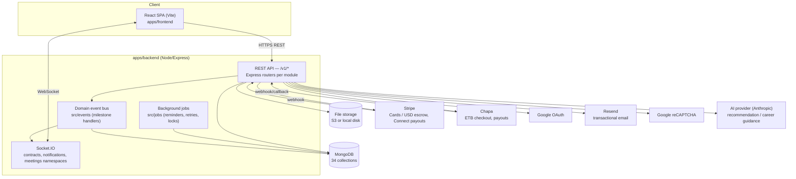

# Architecture

NexusWork is a MERN-stack application (MongoDB, Express, React, Node) split
into two deployables — `apps/backend` (API + WebSocket + background jobs) and
`apps/frontend` (React SPA) — plus infrastructure config for containerized
deployment. This document is the system-level view; module-by-module detail
lives in [`api/README.md`](../api/README.md) and [`database/README.md`](../database/README.md),
and the financial-system evolution is documented separately in the
[phase 0–3 notes](#financial-architecture-phased-notes) below.

## Component diagram

## Backend layout

`apps/backend/src` is organized by concern, not by layer-first MVC:

- **`modules/<name>/`** — one folder per domain (see the [API reference](../api/README.md#modules)
  for the full list of 30 modules). Each module follows the same internal
  shape: `*.routes.js` (Express router + middleware wiring) →
  `*.controller.js` (HTTP glue, thin) → `*.service.js` (business logic,
  transactions) → `*.model.js` (Mongoose schema). Modules re-export their
  router from `index.js`, which is what `api/v1/routes.js` imports.
- **`api/v1/routes.js`** — the single place every module is mounted under
  `/v1/<module>`.
- **`middleware/`** — cross-cutting concerns: `auth.middleware.js`
  (JWT verification), `role.middleware.js` (RBAC), `verification.middleware.js`
  (email-verified gate), `rateLimiter.middleware.js`, `upload.middleware.js`,
  `validation.middleware.js`, `request-context.middleware.js` (request/
  correlation IDs used throughout `AuditLog`), `error.middleware.js`.
- **`shared/`** — cross-module utilities: Zod `validators/`, `money/money.js`
  (minor-unit arithmetic helpers), `permissions/permissions.js`,
  `authorization/resource-authorization.js` (ownership checks reused across
  modules), `exceptions/AppError.js`, `logger/`, `mailer/`.
- **`config/`** — environment-driven configuration modules, one per external
  concern (`database`, `auth`, `payment`, `google`, `mail`, `storage`,
  `socket`, `recaptcha`, `cors`, `logger`), plus `env.js`/`env.validation.js`
  which centralize and fail-fast on missing required variables.
- **`websocket/`** — Socket.IO server setup (`index.js`) and three namespaces:
  `contract.namespace.js` (chat + live contract/milestone status),
  `notification.namespace.js` (push new `Notification` documents), and
  `meeting.namespace.js` (WebRTC offer/answer/ICE relay for video calls —
  media itself stays peer-to-peer in the browser; see
  [`meetings-and-i18n.md`](../meetings-and-i18n.md)).
- **`jobs/`** — scheduled/background work with a Mongo-backed
  (`job-lock.model.js`) lock so only one instance runs a job at a time in a
  multi-replica deployment.
- **`events/`** — an in-process `EventEmitter`-based domain event bus;
  `handlers/milestone.handlers.js` reacts to milestone lifecycle events (e.g.
  to fan out notifications) without coupling the milestone service directly
  to every downstream concern.
- **`templates/`** — server-rendered artifacts: transactional email HTML
  (`email/`), invoice PDF/CSV (`invoice/`), and the skill/identity credential
  PDF card (`credential/`).
- **`seed/`** — idempotent seed scripts for categories, skills, projects, and
  demo users, used in development and CI.

## Frontend layout

`apps/frontend/src` is a Vite + React 18 SPA:

- **`app/`** — top-level providers (`AuthProvider`, `QueryProvider` wrapping
  TanStack Query, `SocketProvider`, `ThemeProvider`) and the router
  (`app/router/index.jsx`, `app/router/guards.jsx` for role/auth-gated
  routes).
- **`routes/`** — route table split by audience: `public.routes.jsx`,
  `student.routes.jsx`, `client.routes.jsx`, `university.routes.jsx`,
  `admin.routes.jsx`, composed in `routes/index.jsx`.
- **`features/<name>/`** — one folder per page/feature area, mirroring the
  backend module split where it makes sense (`contracts/`, `payments/`,
  `wallets/`, `verifications/`, `meetings/`, `admin/`, etc.). Each typically
  owns its own page component(s) plus feature-local pieces.
- **`services/api/`** — one thin HTTP client module per backend module
  (`contracts.api.js`, `payments.api.js`, ...), all going through
  `lib/http.js` (an `axios`/`fetch` wrapper handling auth headers, CSRF
  token, and error normalization).
- **`components/ui/`** and **`components/ui/shadcn/`** — the design system:
  hand-built primitives plus shadcn/ui-derived Radix components, styled with
  Tailwind (`styles/tailwind.css`, `tailwind.config.js`).
- **`stores/`** — Zustand stores (`auth.store.js`, `ui.store.js`) for client
  state that doesn't belong in TanStack Query's server-state cache.
  Constants live in `constants/` are the frontend's copy of the backend enum
  values (kept in sync by convention, not by a shared package).
- **`i18n/`** — i18next setup with English, Amharic, and Afaan Oromoo locale
  resources; see [`meetings-and-i18n.md`](../meetings-and-i18n.md).

## Data flow: a milestone payment, end to end

1. Client funds a milestone → `POST /v1/milestones/:id/fund` → `milestones.service.js`
   calls the active payment provider adapter (`modules/payments/providers/`)
   to create a payment intent/checkout session, and writes a `Payment`
   (`direction: deposit`, `status: pending`).
2. The provider's webhook (`POST /webhooks/stripe` or `POST /webhooks/chapa`)
   confirms success; `webhooks.controller.js` verifies the signature against
   the raw body, deduplicates via `WebhookEvent`, updates the `Payment` and
   `Milestone` status to `funded`, posts balanced entries to
   `FinancialJournal`, and emits a milestone-funded domain event.
3. `events/handlers/milestone.handlers.js` reacts: writes a `Notification`,
   pushes it over the `notifications` Socket.IO namespace, and appends an
   `AuditLog` entry.
4. Student marks work `submitted` → client `approve`s → `milestones.service.js`
   triggers a `release` payment (transfer/payout to the student's connected
   account or Chapa payout), and a `commission` payment to the platform,
   again through the provider abstraction and the ledger.

This is the pattern every state-changing module follows: **route → validated
controller → service (owns the transaction and cross-collection writes) →
domain event → notification/audit fan-out**.

## Financial architecture (phased notes)

The payments/ledger design was built up in four documented phases, kept as
separate notes because each phase records the *evidence and constraints* at
the time, not just the end state:

1. [Phase 0 — financial boundary inventory](./phase-0-financial-boundary.md):
   catalogs every pre-existing money field and its float-precision risk before
   any redesign.
2. [Phase 1 — payment provider and money boundary](./phase-1-payment-boundary.md):
   introduces the provider-neutral adapter interface and canonical
   integer-minor-unit shape (`{ amountMinor, currency }`), without yet
   building a ledger.
3. [Phase 2 — financial ledger](./phase-2-financial-ledger.md): adds the
   append-only `FinancialAccount`/`FinancialJournal` double-entry ledger
   described in the [database docs](../database/schema.md#financial-ledger-append-only-minor-units-only).
4. [Phase 3 — Ethiopian PSP (Chapa)](./phase-3-ethiopian-psp.md): adds the
   second payment provider for ETB, behind the same adapter interface from
   Phase 1.

Security posture for money- and identity-adjacent endpoints is tracked
separately in [`security/phase-0-authorization-matrix.md`](../security/phase-0-authorization-matrix.md).

## Deployment topology

See [`deployment/README.md`](../deployment/README.md) for the full runbook.
In short: `docker-compose.yml` runs four services — `mongo`, a one-shot
`mongo-init` (index/seed bootstrap), `backend`, and `frontend` (built static
assets served by nginx, see `infrastructure/nginx/nginx.conf`). Production
compose (`docker-compose.prod.yml`) and the CI pipeline
(`.github/workflows/ci.yml`) build and (optionally) push the same two
container images.

## UML and diagrams

Use-case, sequence, class, and deployment diagrams are in
[`uml/README.md`](../uml/README.md).
