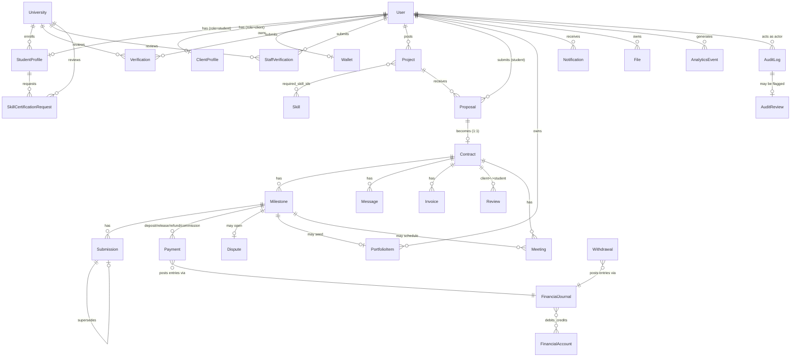

# Database

NexusWork stores data in MongoDB (Mongoose ODM). There are **34 collections** across
identity, marketplace, contract/escrow, financial-ledger, and platform-operations
concerns. This document is the entity-relationship overview; the full field-by-field
data dictionary lives in [`schema.md`](./schema.md).

Source of truth for every field below is the Mongoose schema file under
`apps/backend/src/modules/<module>/*.model.js` — if this document and the code ever
disagree, the code wins.

## Entity-relationship diagram

## Collections at a glance

| Domain | Collections |
| --- | --- |
| Identity & access | `User`, `StudentProfile`, `ClientProfile`, `University`, `RevokedToken`, `PasswordResetToken`, `EmailVerificationToken` |
| Verification & credentials | `Verification`, `StaffVerification`, `SkillCertificationRequest` |
| Catalog | `Category`, `Skill`, `LearningResource` |
| Marketplace core | `Project`, `Proposal`, `Contract`, `Milestone`, `Submission` |
| Money movement | `Payment`, `Invoice`, `Wallet`, `Withdrawal`, `WebhookEvent` |
| Financial ledger (append-only) | `FinancialAccount`, `FinancialJournal` |
| Collaboration | `Message`, `Meeting`, `Review`, `Dispute` |
| Portfolio & matching | `PortfolioItem`, `RecommendationCache` |
| Platform operations | `File`, `Notification`, `AdminAction`, `AnalyticsEvent`, `AuditLog`, `AuditReview` |

One collection is an intentional placeholder in the current codebase: **`Search`**
holds only a `_placeholder` boolean — full-text search is served by Mongo text
indexes on `Project`/`Skill`/`LearningResource`, not a dedicated collection. See
`search.model.js` and `search.service.js`.

## Design conventions worth knowing

- **IDs**: every relationship is a Mongo `ObjectId` reference (`ref: "..."`); there
  is no `$lookup`/populate abstraction beyond Mongoose's own `.populate()`.
- **Money**: legacy fields (`amount`, `price`, `budget`) are major-unit `Number`s;
  newer fields (`amount_minor`, `price_minor`, `debit_minor`/`credit_minor`) are
  integer minor units (cents). Both exist side-by-side during the ledger migration
  — see [`architecture/phase-0-financial-boundary.md`](../architecture/phase-0-financial-boundary.md)
  through [`phase-2-financial-ledger.md`](../architecture/phase-2-financial-ledger.md).
- **Append-only collections**: `AuditLog` and `FinancialJournal` reject `update*`
  and `delete*` operations at the Mongoose middleware level (`pre` hooks throw).
  Corrections are new documents (a reversal journal, a new audit event), never
  mutations.
- **One-per-key uniqueness** is enforced with compound/partial unique indexes
  rather than in application code — e.g. one `Proposal` per `(project_id,
  student_id)`, one `Milestone` per `(contract_id, sequence)`, one active
  `Payment` per `(milestone_id, direction)` (via `partialFilterExpression`).
- **Status machines** live as `enum` string fields, not a separate state-machine
  collection. See [`schema.md`](./schema.md) for every enum's allowed values, and
  `apps/backend/src/shared/enums/status.enum.js` for the canonical list used by
  the backend (mirrored in `apps/frontend/src/constants/status.constants.js`).

## Indexing

Indexes are declared inline in each model file and also centralized for review in
`apps/backend/src/config/database.indexes.js`. Notable ones beyond the obvious
foreign-key lookups:

- **Text indexes**: `Project` (`title`, `description`, `required_skills`), `Skill`
  (`name`, `category`), `LearningResource` (`title`, `description`, `tags`).
- **TTL indexes** (auto-expiring documents): `RevokedToken`, `PasswordResetToken`,
  `EmailVerificationToken` all expire via `expires_at` + `expireAfterSeconds: 0`.
- **Partial unique indexes**: `Payment` (one active payment per milestone+direction),
  `StudentProfile` (`student_id_number` unique per university, only when set),
  `PortfolioItem` (`milestone_id` unique when present), `SkillCertificationRequest`
  (one pending request per student+skill).

## Where this doc comes from

This overview and the data dictionary were generated from the live Mongoose
schemas in `apps/backend/src/modules/**/*.model.js`, cross-checked against the
route/controller layer for which fields are actually read and written. Where the
original project proposal described a field the implementation doesn't have, the
code's version is documented here — see [`requirements/README.md`](../requirements/README.md)
for where the build diverged from the proposal.
