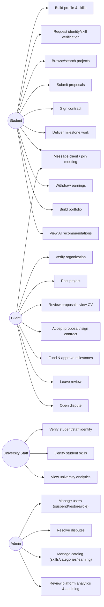
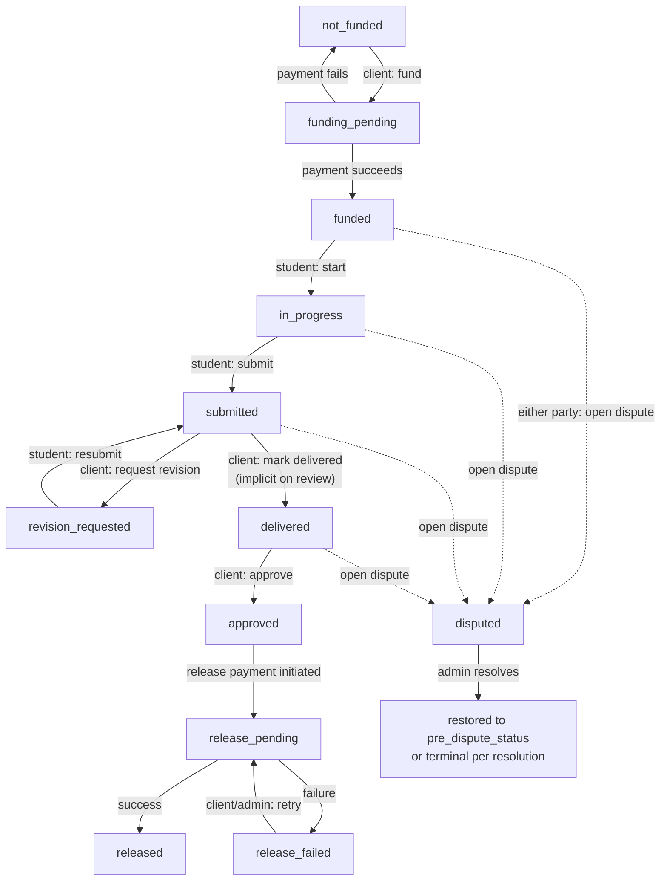
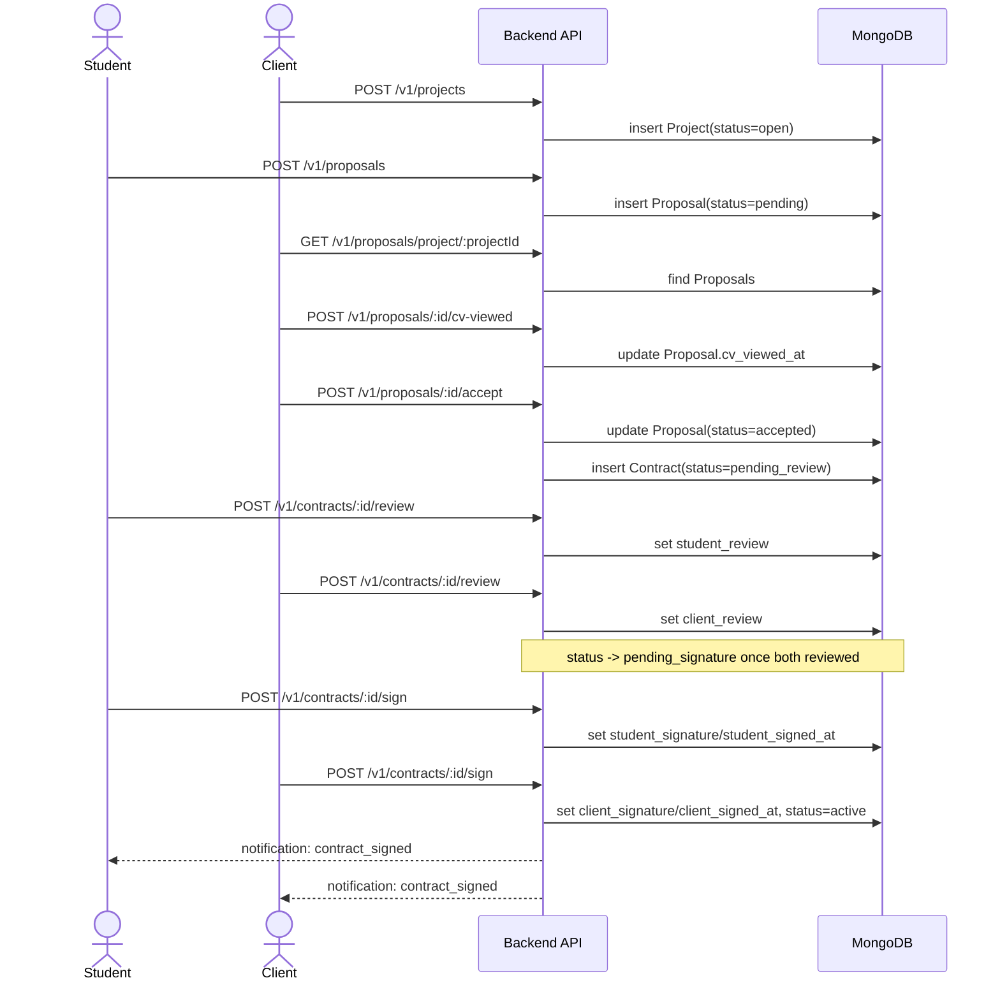
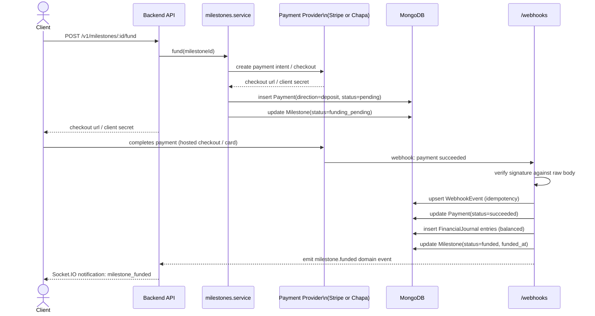
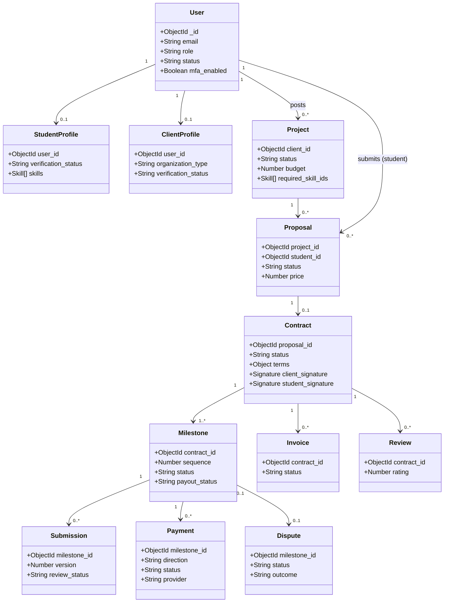
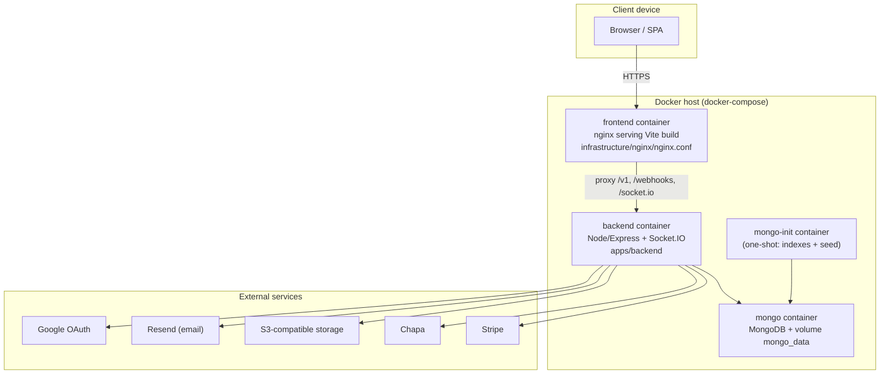

# UML

Diagrams reflect the implemented system (see [`architecture/README.md`](../architecture/README.md)
and [`database/README.md`](../database/README.md) for the prose versions).
Rendered as Mermaid so they stay in the repo as text and render in any
Markdown viewer that supports Mermaid (GitHub, GitLab, VS Code, etc.).

## Use-case diagram

Mermaid has no native UML use-case notation, so this is expressed as an
actor→capability map; it covers the same information a use-case diagram would.

## Activity diagram — milestone lifecycle

## Sequence diagram — proposal to signed contract

## Sequence diagram — milestone funding via payment provider

## Class diagram — core marketplace/escrow domain

## Component diagram

See [`architecture/README.md`](../architecture/README.md#component-diagram)
for the Mermaid component/flow diagram covering the SPA, API, WebSocket
layer, background jobs, database, storage, and external providers — kept in
one place to avoid duplication/drift.

## Deployment diagram

Production compose (`docker-compose.prod.yml`) uses the same two application
images with production-oriented environment variables; see
[`deployment/README.md`](../deployment/README.md).
